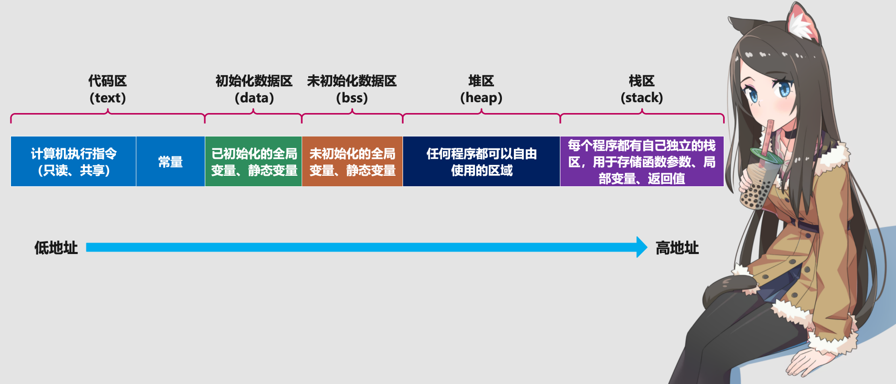

### 1. 预处理（Preprocess）

预编译把一些#define的宏定义完成文本替换，然后将#include的文件里的内容复制到.cpp文件里，如果.h文件里还有.h文件，就递归展开。在预处理这一步，代码注释直接被忽略，不会进入到后续的处理中，所以注释在程序中不会执行。

    g++ -E -I include/ main.cpp -o main.i
    # 或者直接调用 cpp 命令
    cpp -I include/ main.cpp -o main.i

### 2. 编译（Compile）

编译只是把我们写的代码转为汇编代码，它的工作是检查词法和语法规则，所以，如果程序没有词法或则语法错误，那么不管逻辑是怎样错误的，都不会报错。

    g++ -S -I include/ main.cpp -o main.s

### 3. 汇编（Assemble）

汇编过程将上一步的汇编代码(main.s)转换成机器码(machine code)，这一步产生的文件叫做目标文件

    g++ -c -I include/ main.cpp -o main.o
    # 或者直接调用 as 命令
    as main.s -o main.o

汇编这一步需要为每一个源文件（本文示例代码中为main.cpp、func.cpp）产生一个目标文件。因此func.cpp也需要执行一次这个汇编过程产生一个func.o文件:

    # 可以用 g++ -c 命令一步生成 func.o
    g++ -c -I include/ src/func.cpp -o src/func.o
    # 当然也可以按照上面的预处理、编译、汇编三个步骤生成func.o

### 4. 链接（Link）

C/C++代码经过汇编之后生成的目标文件(\*.o)并不是最终的可执行二进制文件，而仍是一种中间文件(或称临时文件)，目标文件仍然需要经过链接(Link)才能变成可执行文件。

    g++ src/func.o main.o -o main.out

详细内容参考可以参考这篇[博客文章][1]。

### 5. 存储结构

C 源文件经过预处理、编译、汇编、链接，这四步之后会生成一个可执行程序。在程序还没有运行之前，也就是程序还没有加载到内存之前，可执行程序内部就已经分好了三个区域，分别是：代码区（text）、初始化数据区（data）、未初始化数据区（bss）。

[1]: https://wx-chevalier.github.io/books/cpp-notes/01.%E8%AF%AD%E6%B3%95%E5%9F%BA%E7%A1%80/%E7%BC%96%E8%AF%91%E4%B8%8E%E8%BF%90%E8%A1%8C/%E7%BC%96%E8%AF%91%E5%99%A8/gcc/99.%E5%8F%82%E8%80%83%E8%B5%84%E6%96%99/2023-%E8%AF%A6%E8%A7%A3-c-c++-%E4%BB%A3%E7%A0%81%E7%9A%84%E9%A2%84%E5%A4%84%E7%90%86%E7%BC%96%E8%AF%91%E6%B1%87%E7%BC%96%E9%93%BE%E6%8E%A5%E5%85%A8%E8%BF%87%E7%A8%8B/

[2]: https://www.cnblogs.com/traditional/p/13194862.html